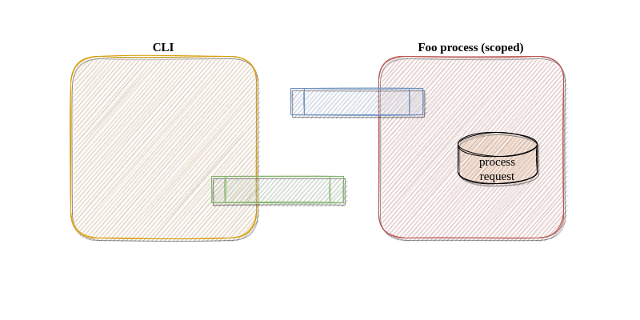

# IPC Notes

- For IPC communication we are using pair of posix message queue:

- The client in the communication is `scope`
- The server in the communication is scoped application
- The message queue created by `scope` is `ScopeIPCOut.<PID>`
- The message queue created by scoped application is `ScopeIPCIn.<PID>`
- scoped application reads from `ScopeIPCIn.<PID>` and writes to `ScopeIPCOut.<PID>`
- `scope` reads from `ScopeIPCOut.<PID>` and writes to `ScopeIPCIn.<PID>`

# Protocol

- Request/Response can consist of multpile mesages

- Client Request

| Field name   | Length (bytes) | Description                                              |
|--------------|----------------|----------------------------------------------------------|
| INS          | 1              | IPC command (e.g getScopeStatus)                         |
| REQ_ID       | 1              | Unique ID of the request (randomize by client)           |
| MSG_NO       | 1              | Current Id of the message                                |
| TOTAL_MSG_NO | 1              | Total number of messages within this request             |
| REQ_DATA     | n              | Req data e.g. cfg in case of setCfg                      |

- Server Response

| Field name | Length (bytes) | Description                                                          |
|------------|----------------|----------------------------------------------------------------------|
| REQ_ID     | 1              | ID of the response equals to unique ID of the request                |
| STATUS     | 1              | Overall status of request                                            |
|            |                | - examples success, command not found, command failed                |
| MSG_NO     | 1              | Current Id of the message                                            |
| MAX_ID     | 1              | Total number of messages within this response                        |
| RESP_DATA  | n              | Response data e.g. cfg in case of getCfg                             |

Example communication

Get Scope Status messsage
Request:
-> 0x01 0xCD 01 01

INS - 0x01 - GetScopeStatus
REQ_ID - 0xCD - Unique Id of this request
MSG_NO - 0x01 - Message no 1
TOTAL_MSG_NO - 0x01 - Total message of this request is 1

Respones for get Scope Status messsage -> scope is Active
Response:
<- 0xCD 0x00 01 01 01

REQ_ID - 0xCD - GetScopeStatus
STATUS - 0x00 - OK (Success)
MSG_NO - 0x01 - message no 1
TOTAL_MSG_NO - 0x01 - total message of this request is 1
RESP_DATA - 0x01 - (0x01 - Active state, 0x00 - Latent state)

Questions:
- ID, Request ID, MSG_NO, MAX_ID - is one byt sufficient ?
- Do we need to know version of the client ?
- RESP_DATA, REQ_DATA interpreation for each commmand should be immutable once defined