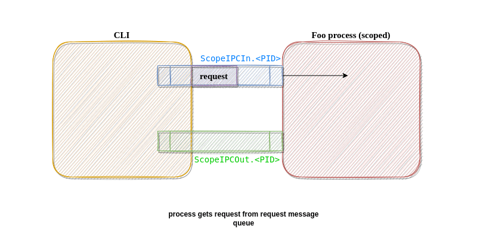

# IPC Notes

- For IPC communication we are using pair of posix message queue:

- The client in the communication is `scope`
- The server in the communication is scoped application
- The message queue created by `scope` is `ScopeIPCOut.<PID>`
- The message queue created by scoped application is `ScopeIPCIn.<PID>`
- scoped application reads from `ScopeIPCIn.<PID>` and writes to `ScopeIPCOut.<PID>`
- `scope` reads from `ScopeIPCOut.<PID>` and writecopeIPCIn.<PID>`

[Protocol Proposal]

#Metadata

#REQ
[VERSION][INS][INS]

#RESP
[VERSION][INS][INS]

VERSION - Version used by CLI 3 bytes
INS - Instruction cmd bytes 2 bytes